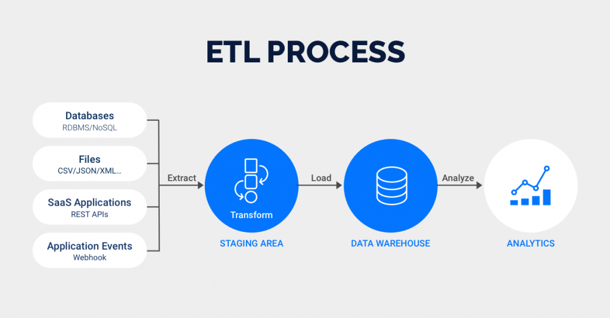

# Building ETL (Extract, Transform, Load) in Python 
##### What is ETL (Extract, Transform, Load)?
Extract, transform, and load (ETL) is a data integration methodology that extracts raw data from sources, transforms the data on a secondary processing server, and then loads the data into a target database.

# Requirements
You will need the following software:
- `glob`, a package that is preinstalled that searches for files in relative paths.
For details, see this [section](https://docs.python.org/3/library/glob.html "section") for documentation.
- `pandas`, a package used for data manipulation. To install, type on the command line, `pip install pandas`.
For details, see the [pandas](https://pandas.pydata.org/ "pandas") site.

